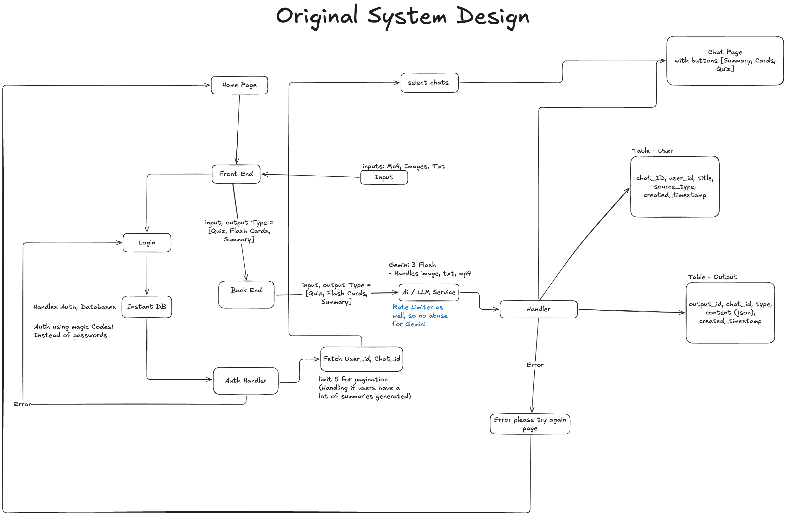

# 🧠 Cramly

An AI study tool which transforms lecture material into summaries, quizzes, and flashcards.

**Live Site:** https://aisummary-production.up.railway.app

---

## How it works

Upload a PDF, image, audio, or video file and Cramly can:

- Generate a structured **summary** with a TL;DR, sections, and key points
- Build a **quiz** with multiple-choice questions and per-answer explanations (Regular or Detailed mode)
- Create flashcards you can flip through
- Let you **regenerate quizzes** for fresh practice questions from the same material

---

## Tech Stack

### Frontend
| Tech | Purpose |
|---|---|
| React | UI components and state management |
| React Router | Client-side routing |
| Vite| Build tool and local dev server |
| InstantDB React | Real-time reactive queries and auth |

### Backend
| Tech | Purpose |
|---|---|
| Node.js + Express| REST API server |
| Multer| file upload handling |
| Helmet | HTTP security headers + CSP |
| express-rate-limit | Abuse protection with rate limter (30 req / 15 min) |
| dotenv| Environment variable management |
| InstantDB Admin SDK | Persisting chats and outputs to the database via `db.transact` |
| Google Gemini 2.5 Flash | Multi-modal AI for generating summaries, quizzes, and flashcards |

---

## Architecture



### Work Flow 

1. User uploads a file and selects an output type (summary / quiz / flashcards)
2. Server always generates a **summary first** from the raw file
3. If the user requested quiz or flashcards, a second Gemini call generates that output from the summary
4. Both results are written to InstantDB via atomic transactions (`chats` → `outputs`)
5. The React client's live query automatically re-renders with the new data

### Quiz regeneration flow

To avoid a blank gap in the UI during regeneration:
1. Generate the new quiz from the existing summary
2. Save the new quiz to InstantDB
3. **Then** delete the old quiz

The React client sees the new output arrive before the old one disappears, so there is no empty state.

---

## Database Schema (InstantDB)

```
users
  └── chats           (chat_id, title, source_type, created_at)
        └── outputs   (output_id, type, content JSON, created_at)
```

- `chats` is linked to a user via InstantDB's built-in `$user` link
- `outputs` is linked to a `chat` — each chat can have one summary, one quiz, and one flashcard deck
- The `content` field stores the full Gemini response as JSON (questions array, cards array, sections, etc.)
- Pagination on the home page uses `limit: 6, offset: page * 5` — if 6 results come back, there is a next page

## Supported File Types

| Type | Formats |
|---|---|
| Documents | PDF, TXT |
| Images | JPEG, PNG |
| Video | MP4 |
| Audio | MP3 |

Max file size: **25 MB**

---

## Security

- **Helmet** sets strict HTTP headers including a Content Security Policy that allowlists only InstantDB and Google Fonts
- **Rate limiting** caps requests at 30 per IP per 15 minutes
- **MIME type validation** rejects unsupported file types before they reach Gemini
- **UUID validation** on all `userId` and `chatId` inputs
- **Gemini response sanitization** — code fences and unexpected wrappers are stripped before JSON parsing

--- 
## Design Decisions 
- For the Database Schema, I original wanted to go with the design of using three tables [Cards, Quiz, Summary]. Instead I decided to use one simple output table with the output_id, which type is was which cards, quiz, or summary. Creating a simple table instead of introducing the complexity of querying from three tables. 
- Users can choose to generate different types of study material like summaries, flash cards, and quizzes. However I found, if we didn't store/generate the summary of the materials, the quaility of the quizs and flash cards would drop dramatically. So I decided if the user wanted quizes or flash cards, we would generate summaries along side them. 
* **Why don't you store the original content users upload?**  I decided not to store the original content as that would lead to scaling issues later on with having to store large amounts of data. For now we are generate the summary then using that to generate the quiz. 
- I choose Gemini, instead of other AI services as currently other options don't offer mp4 support for their API. 
- I choose InstantDB vs alternatives, as it handled the authenticator, and databases all in one package. So it limited complexity and offered an all in one package. 
